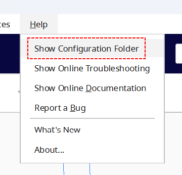
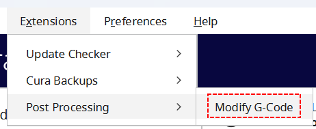
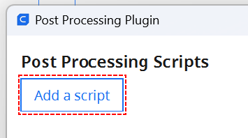
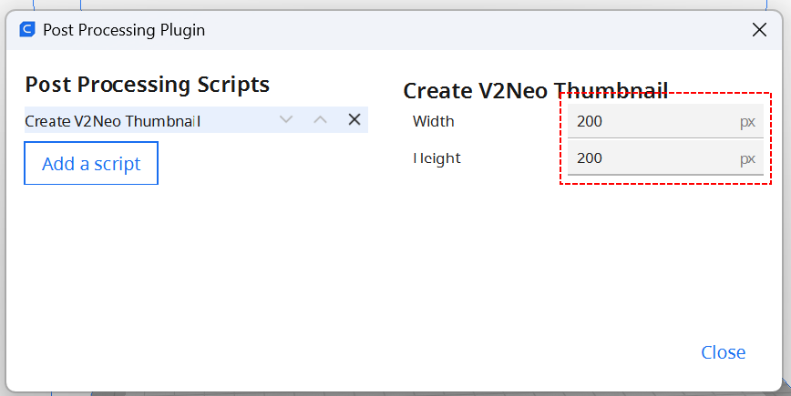
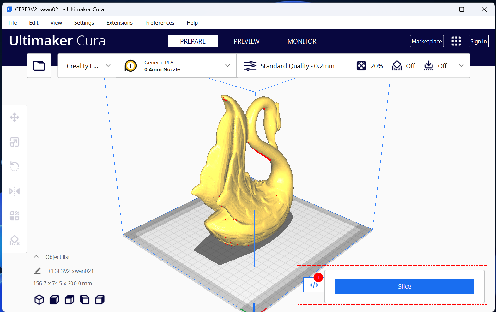
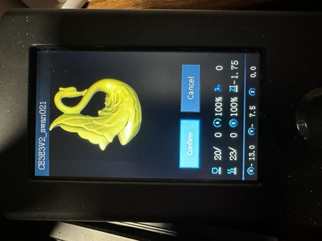
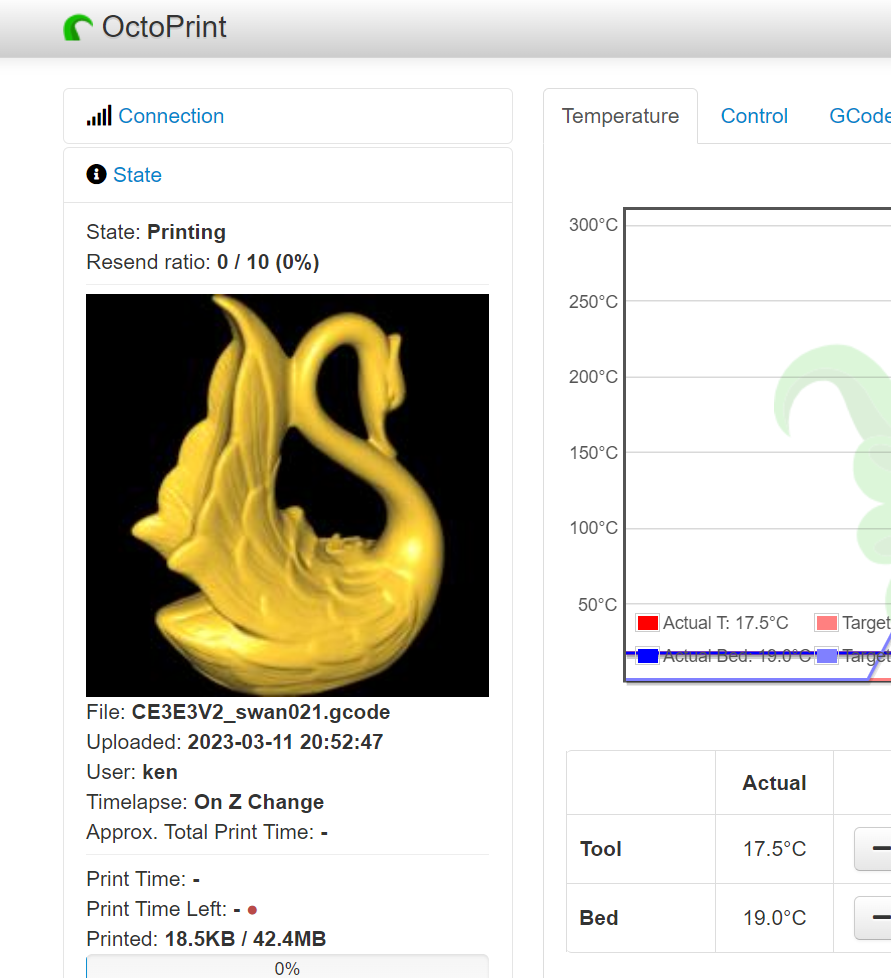

**This is no longer maintained as I no longer own an Ender 3. See [this fork by coco2299](https://github.com/coco2299/UltimakerCuraEnder3V2NeoThumbnailScript) for a newer version.**

# Generating gcode preview for Ender-3 V2 Neo

Many 3D printers have firmware that supports displaying an image embedded in gcode files. Unfortunately there isn't a standard format for these embedded images. Different printer models expect different image formats within gcode files. Because of this, there are a handful of scripts that generate these embedded images.

This script works with the **Ender-3 V2 Neo**, but it may work with other printer models. If it works with your printer, send me a message and I will document it here so others will be aware.

**Note**: This script _only_ works with the **Cura** and **Creality** slicers version 4 or newer.

# Installation Steps

## Determine where the script belongs

Start Cura and choose the `Help -> Show Configuration Folder` menu.

This menu item will launch a file browser showing a directory that has a `scripts` subdirectory.

Note the location of the `scripts` directory. The directory path will vary based on your windows user id and the version of Cura that you are running. As an example, for me the path is `C:\Users\huffm\AppData\Roaming\cura\5.2\scripts`.

This script will be placed in that directory.

## Download the script

If Cura is running, exit the program. Configuration changes will not take affect while the program is running.

Download the script from [here](https://raw.githubusercontent.com/KenHuffman/UltimakerCuraScripts/main/scripts/CreateV2NeoThumbnail.py). Use right-click on the link and select `Save link as...`. When prompted for the download directory, choose the `scripts` directory noted above.

## Add the script to Cura

Launch Cura again, and choose `Extensions -> Post Processing -> Modify G-Code`

On the `Post Processing Plugin` dialog, select the `Add a script` button.

From the pop up a list of available plugins, select `Create V2Neo Thumbnail`. On the right half of that dialog, specify `200` for both the `Width` and `Height` values.

Finally close the dialog.

## Slice as you normally would

Slice your object and save to SD card.

Then print from your printer's user interface

# Troubleshooting

- This works with firmware that ships with the Ender-3 V2 Neo. Custom firmware may require a different script to generate the image.
- Make sure you are running the Cura or Creality slicer. This does not work with the Prusa/Super slicer.
- The file in the `scripts` directory should have a `.py` extension when you save it, _not_ `.py.txt`. If you are not sure, you can right-click on the downloaded file and view its Properties which will show its extension.
- Make sure the thumbnail size on the `Post Processing Plugin` is 200x200.
- If you have other plugins that modify g-code, you might try removing them (at least temporarily). The Creality firmware is very picky about where the image is placed in the gcode file and multiple plugins may move the embedded image.
- Check the `cura.log` file in Cura's installation directory. Search for `Begin loading of script: CreateV2NeoThumbnail`
- Look at the gcode file generated, the **first** should be a line should look like (the numbers may be different):

  `; jpg begin 200*200 3486 3 197 500`

# Octoprint

If you use [OctoPrint](https://octoprint.org/) you can use the [Slicer Thumbnails](https://github.com/jneilliii/OctoPrint-PrusaSlicerThumbnails) plugin to display these embedded images as well.

